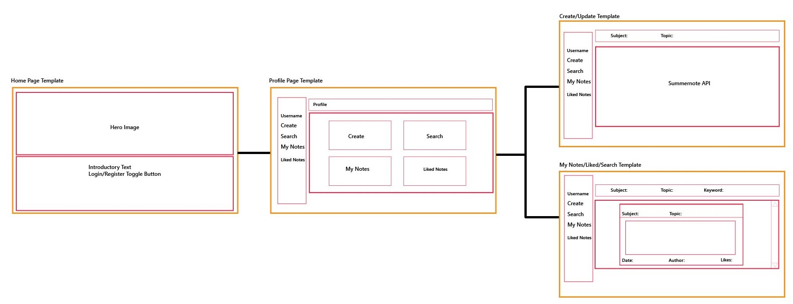
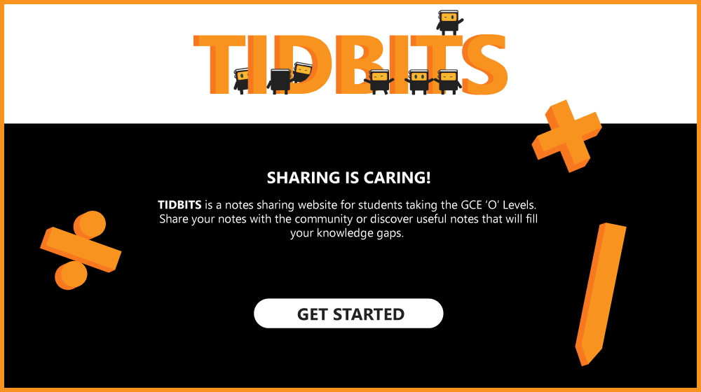
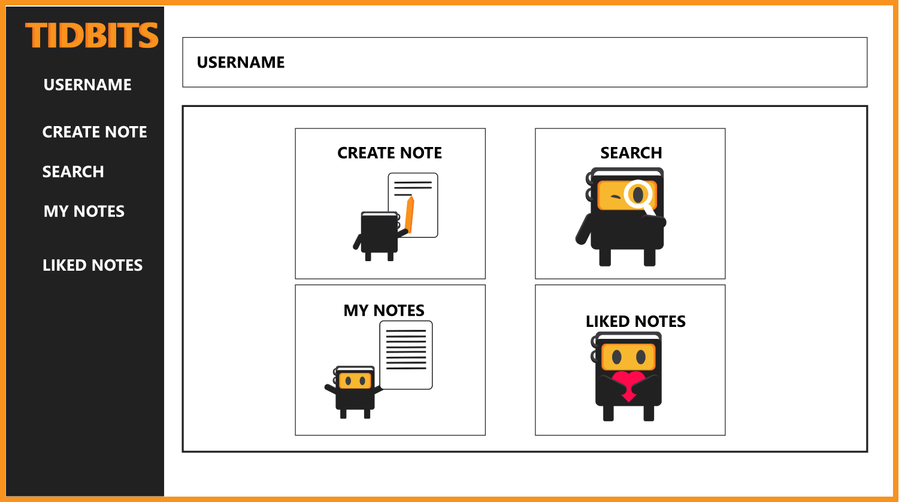
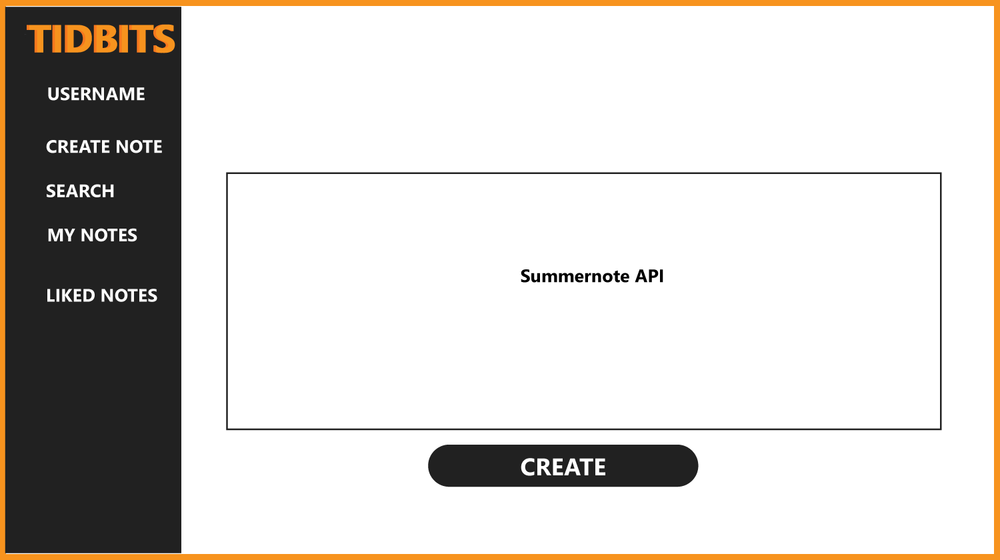
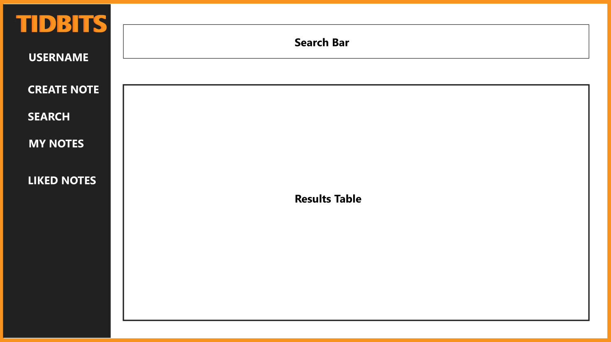

# TIDBITS - Notes Sharing Website for the GCE 'O' Levels 
The website can be viewed [here](https://lch-notes-app.herokuapp.com/).

## Data-Centric Development Milestone Project
Build a full-stack website that allows user to manage a common dataset, which includes allowing users to share their own data with the community and having access to data by others. Main technologies used should include HTML, CSS, JavaScript, Python, Flask & Mongodb.

## Strategy
### Problem
Many students may not have access to tuition financially or may find it difficult to approach others for help. As tech-savy youngsters, students these days are more inclined towards finding answers online on their own. An online platform that provides them a degree of anonymity and connection to a larger community online will allow them to have access to academic help or to offer help to others. 

### Proposed Solution
Create a web application to provide a self-help platform where anyone(preferably students themselves) can volunteer to teach share notes and tips. For a start, let's limit the scope to the GCE 'O' Levels. Additionally, as the saying goes, the best way to learn something is to teach.  This online platform gives users an opportunity to teach and consolidate their ideas.

### External Users' Goals
Users who want to share notes: 
1. To volunteer teach, help others out in solving school work and get better academic results.
2. Improve their own teaching skills or to build confidence in certain concepts themselves.

Students/Learners: 
1. To gain further insights, fill their knowledge gaps or learn advanced concepts from others.

### Site Owner's Goals
1. To encourage self-learning and resourcefulness.
2. Providing a platform for needy students to access notes of anyone who wants to help.
3. Encourage people to share and create notes as a learning method itself, as the best way to learn is to teach others.

## Scope
### Required Functionalities
- CREATE/UPDATE/DELETE: Allows users to create a profile and post their notes. (flask, mongodb, summernote)
- READ: Users can access and search for the subjects they want to learn about. (js, mongodb, flask)
- Allow users to save notes to their accounts. (mongodb)
- Allow users to give a like to the note. (js, mongodb)
- Profile pages should allow users to view their own notes, saved notes from elsewhere.
- Backend codes will handle(CRUD) the database(MongoDB). Frontend codes will handle the UI/UX.
- Present notes and ideas in an elegant and neat manner.

### Frontend
HTML
CSS
JS, JQUERY
Bootstrap

### Backend
Mongodb
Python

### API
Summernote

### Syallabus
#### Geography
1. Our Dynamic Planet
2. Our Changing World

#### Chemistry
1. Experimental Chemistry
2. Atomic Structure & Stoichiometry
3. Chemistry of Reactions
4. Periodicity
5. Atmosphere
6. Organic Chemistry

#### Physics
1. Measurement
2. Newtonian Mechanics
3. Thermal Physics
4. Waves
5. Electricity & Magnetism

#### Math
1. Number & Algebra
2. Geometry & Measurement
3. Statistics & Probablity

## Structure

The website is designed such that the user will experience the following sequence:
1. Home Page:
- Gives a brief introduction about the website for users to understand the website's purpose.
- Displays the brand name and hero image for visitors to know and remember.
- Provides a login/register link for users to move to the next step.

2. Profile Page:
- Provides a brief information about the user or other users.
- The 4 panels will equip the user with knowledge about where to navigate to next and make the best use of the website.

3. CRUD Tools
- Create/Update Page should allow the user to simply create a note without much hassle.
- Search/My Notes/Liked Notes Page should allow the user to find notes according to a keyword search or by topics and subjects.
- Multiple results can be handled by pagination.

## Skeleton
The images below do not represent the actual state of the website as it is constantly improved upon. They are prototype skeletal plans for the initial making of the website. Enter the website to fully enjoy the illustrations and content.

#### Home Page
Essentially, the home page is split into two halves. The top half will provide space for the hero image and brand name, while the second half will display a Hero message and a short introductory paragraph that will not take up too much attention span of students using the website. A 'get started' button is the call to action button that will allow users to login/register.

#### Profile Page
The profile page will give the user a first look inside the website. The toolbar on the left acts as a navigation panel to the CRUD tools available for the website's objectives. The main feature of this page is the 4 panels with mascots that guide the user on their next course of action.

#### Create/Update Page
The create and update page will simply provide the user with an interface of a text editor Summernote API to create/edit their notes.

#### Search/Liked Notes/My Notes Page
These pages will feature a search bar on top, allowing users to search by subjects, topics and even by keywords. The desired results will then be displayed in the section below.

## UX/Surface
### Concept
Tidbits is a notes sharing website for students. The name depicts how the bite-sized information on notes can be digested by learners to fill in their knowledge gaps, just like how people eat tidbits to satisfy their appetite for food.

The mascots' design are based on the look of a notebook. Since a notes sharing website will be expected to mainly filled with text, I have decided to implement more images to strike a balance. Additionally, the mascots lighten the mood of studying since it is often viewed as unnerving and daunting to students. The multiple mascots signify the community that comes together and interacting with each other.

The tool/navigation bar on the left allows easy access for the user to choose their next course of action. It is for users to easily create or search for notes with a few clicks.

### Color Scheme
The colors of the website are mainly restricted to black, white and orange. Blue and red were intially considered as according to psychology, these two colors can help boost the efficiency of learning. However, I believe that blue will only work, for instance, on the walls of a classroom and red is used for highlighting keywords on the notes itself. Hence these two colors might be not as effective in their effects on a website.

The color orange was chosen because I find that not only it meshes well with black and white, but this color also represents feelings of optimism, excitement, enthusiasm and warmth. I hope that this color will fill these emotions in inquisitive and dilligent students as they use the website.

### User Stories
1. As a teacher/student, I will click on the 'Get Started' button to sign in or sign up for an account, so that I can use the functions of this website.
2. As a content creator, I will click on the create button/panel, so that I can start creating a note and post it online.
3. As a teacher/student, I will use the options on the search bar, so that I can look for a specific note, or notes under a subject and topic.
4. As a teacher/student, I will navigate to the search page, so that I can look for a specific note, or notes under a subject and topic.
5. As a content creator, I will navigate to the my notes page, so that I can view the notes that I have created.
6. As a student, I will navigate to the liked notes page, so that I can see the notes that I have liked and saved for future references.
7. As a user, I will click on the logout button on the left panel, so that I can sign out of the website.
8. As a user, I will click on my followers/following, to view the followers/following users that I might be interested in.
9. As a user, I will click on the follow/unfollow button in a particular user's profile, so that I can follow that user and easily access his/her notes in the future. 
10. As a user, I will click on the heart-shaped icon on a note that I like, so that I can save it and view it again in the future.

## Features
### Existing Features
#### Flask Login Module
Flask Login is implemented on this website. Users have to sign up or login with an account to fully enjoy the features of the website. Flask Login provides basic security and privacy features. To sign up, the display name and email must be unique than those registered users in my Mongo database. It is possible to sign up with a dummy/fake email account (e.g. alpha@codeinstitute.com ) since there is no email verification. A bootstrap alert will appear if the display name or email the user is trying to create already exists in the database and the user has to attempt again. pbkdf2_sha256 from the passlib python module is used to encrypt users' passwords in the database.

#### Profile Info
- Profile information such as followers, following, liked notes and likes received can be viewed here.
- Navigating to someone else's profile page allows you to see similar information about their account. But you are not allowed to see their followers and following list.

#### Create Notes with Summernote API!
Create a note and share your knowledge with others! The Summernote API provides features such as:
- subscript superscript (useful for math & sciences)
- highlight
- bold, italics, underline, font styles & family, font sizes
- table
- list
- fullscreen view 

#### Discover Notes with Search
Search results are returned in a card form from Mongo database. Search can be done by subject, topic and keywords (or even a partial word). Each card will contain details besides the shared content such as the date posted, note owner, number of likes, subject and topic. Basic pagination allows users to view results in a more organized manner. Current page number will be in bold.

#### My Notes
View your own creations. Update or edit your note by clicking the edit icon on the top right. Delete a note by clicking the trash icon on the top right.

#### Like System / Liked Notes
View your liked/saved notes in the Liked Notes page. Javascript, together with Jinja conditional-wrapped HTML, work together with my Mongo database to update the number of likes real-time (in the profile page & the respective search/my notes/liked notes pages) and will also identify liked notes such that these notes will load with hearts that are already red in color. Likes for the particular notes will appear at the bottom right of each note. Total likes received and number of liked notes by the user can be view on the user's profile page.

#### Followers System
The profile page will display the number of followers and followed users for the logged in user. Similarly to that of the Like System, Javascript, Jinja and pymongo work together to update the number of followers real-time in the front-end profile page while saving data to the backend database. However, this system is a late addition and I consider this an auxiliary feature in the scope of this project. It is more of a potential feature and the its related pages will look unpolished, although he basic logic and coding of this feature work.

#### Mobile Version
The website can be viewed and used by medium-sized and small-sized devices such as tablets and smartphones as well. The tool/navigation bar on the left will be replaced by a hamburger menu on the top.

### Features Left to Implement
- A more polished Followers System (e.g. detect mutual follow etc)
- Better Pagination System
- Forget password, password verification
- Sorting features (e.g. notes by likes)
- Sharing feature (to social media or messaging apps)
- Profile picture feature

## Technologies Used
- HTML
- CSS
- Javascript
- Jquery
- Bootstrap
- Python
- Flask, Pymongo
- Mongodb
- Google Fonts
- Font Awesome
- Visual Studio Code
- Git
- Github
- Heroku
- Google Chrome, Firefox
- Adobe Illustrator

## Testing
### Website Functions
#### Validation
The multiple template.html were passed through W3 Markup Validation Service. Errors were return because of Jinja templating language. No other major errors were found. No errors were found for my css file. script.js file was passed through Jshint.com. No major errors were found. Unused functions identified by jshint belong to onclick functions in different template.html. 

#### Login/Register
- 'Get Started' button toggles a login/register panel. Clicking on the cross icon closes it.
- Filling up the Register form creates a new account and logs the user in only if all fields are filled.
- Filling up the Login form logs the user in as long as the password and email are correct and filled.
- Entering a display name or email that is already exists in the database will return either "The display name/email is already in use. Please try again."
- Entering a wrong password while logging in will return "Password is wrong. Please try again." bootstrap alert. 
- Entering a wrong email while logging in will return "Email is wrong. Please try again." bootstrap alert. 

#### Left Navigation Panel
- Clicking on the profile icon brings the user to his/her profile page.
- Clicking on the create link will bring the user to https://lch-notes-app.herokuapp.com/create.
- Clicking on the search link brings the user to https://lch-notes-app.herokuapp.com/search.
- Clicking on the my notes link brings the user to https://lch-notes-app.herokuapp.com/mynotes.
- Clicking on the liked notes link brings the user to https://lch-notes-app.herokuapp.com/savednotes.
- Clicking on the logout link brings the user to https://lch-notes-app.herokuapp.com/logout and logs out the user to the home page.

#### Profile Page
- Clicking on followers will allow the user to see a list of their followers at https://lch-notes-app.herokuapp.com/followers/.
- Clicking on following will allow the user to see a list of the users they are following at https://lch-notes-app.herokuapp.com/following/.
- Note that you can only view your OWN followers and following list. While visiting other users' profile pages, their followers and following links will be disabled for privacy.
- Clicking on liked notes will direct the user to https://lch-notes-app.herokuapp.com/savednotes.
- The four panels are a mirror of the left navigation panel. Clicking on 'create a note!' panel brings the user to https://lch-notes-app.herokuapp.com/create, clicking on the 'Discover notes' panel brings the user to https://lch-notes-app.herokuapp.com/search, clicking on the 'edit my notes' panel brings the user to https://lch-notes-app.herokuapp.com/mynotes and lastly, clicking on the 'Notes you like' panel brings the user to https://lch-notes-app.herokuapp.com/savednotes.

#### Create Page
- Creating a note will store a note into the database and the newly created note can be viewed as the last/most recent result in my notes page.
- Clicking on the create button redirects the user to my notes page.

#### Search Page / Search Bar
- When no subject is specified, the results returned are all the notes in the database. Similarly, if no topic is specified, all results returned are the notes under the specified subject. Search by keywords return results containing that search term.
- The search is activated by the magnifying glass icon.
- Pagination works accordingly. Clicking next will allow the user to view the next page of results, vice versa. The current page number will be bold for easier identification. Clicking on a particular page number will also bring the user to that specific page.
- Like: clicking on the heart icon adds a like to the note, turns the heart red, and updates the number of likes. Clicking it on a liked note 'unlikes' the note and will cause the heart to turn back to black and reduces the number of likes. The liked note will appear on the Liked Notes page.
- Clicking on the note's owner name will bring the user to the respective owner's profile page.
- Content posted by users are in their own formatting and are unaffected by the website's css (e.g. if the user posts the note in New Times Roman font family, the note will remain in that format).
- The same search bar is deployed for My Notes and Liked Notes page so it functions in the same manner.

#### My Notes Page
- The heart icon merely shows the owner the number of likes they have for their own notes. It is not clickable.
- Clicking on the edit icon will allow the user to update the note.
- Clicking on the trash icon will allow the user to delete the note after clicking 'Yes' in a confirmation panel.

#### Liked Notes Page 
- Displays the notes liked/saved by the user. Works largely in the same manner as Search page.

### Known Bugs
- Summernote API: tables created may not be mobile responsive.
- Search includes html tags as content generated by Summernote and stored in database is in html. This is usually not a problem as long as the user uses a more specific keyword instead of something like 'p'. The possibility of a html tag matching the user's search term is very low.

### Main Challenges
The main challenge of the making of this website is to find a balance between images and text. Since it is a notes-sharing website after all, this website is expected to be heavily filled with text. Hence, I have spent half the time finding inspirations and designing artwork to balance out the texts and make the website look more attractive.

Other challenges faced will be to think of the logic behind how a Like System will work, how the numbers can be updated real time as the user clicks on the like button, or even clicking it again to 'unlike' it. Additionally, I have to load search results such that whenever a user sees a note that was already liked in the past, the heart icon should be already be red. It may not be the ideal method, but I have managed to achieve these effects by with a combination of python, javascript and jinja conditionals.

## Deployment
This project is coded on Visual Studio Code and respositories are on GitHub. The website is deployed on Heroku. The database is created on MongoDB.

To clone this project:
- Download/clone the master branch of this respository. 
- Ensure that PIP, Visual Studio Code(or other code editors), Python and Git are in your system.
- Install required extensions/modules from requirements.txt by typing "pip -r requirements.txt" in the terminal.

My Setup Steps:
- Create both Heroku and MongoDB accounts.

Flask_Login:
- Use generate_secret_key.py to generate a secret key and save it in a .env file.

MongoDB:
- Create a database and collections for registered users and notes separately.
- Obtain Mongo_URI key that allows connections to the database and save it in a .env file which will be added to .gitignore.
- Create dummy notes and accounts and test the website functions.

Heroku:
- Create a new app and a Procfile that will allow the app to be deployed on Heroku.
- Input .env secret key values inside app settings. Set IP: 0.0.0.0 and Port:5000.
- Install Heroku CLI on Windows and login.
- To push to Heroku from VSC, enter 'git push heroku master'.

## Credits
### Content
- SEAB(Singapore Examinations and Assessment Board) [website](https://www.seab.gov.sg/home/examinations/gce-o-level/o-level-syllabuses-examined-for-school-candidates-2020) for providing details on the 'O' Levels syallabus.
- W3Schools for quick revisions.
- Stackoverflow for helpful answers regarding Jinja templating conditionals and language.
- Summernote API was introduced by my [lecturer](https://github.com/kunxin-chor/).
- Classmate [Donovan](https://github.com/DonovanLoSg) for providing guidance and help in writing a better documentation.
- A friend for creating some of the dummy notes mainly as user 'echo'.

### Media
- Orignal artwork and character designs are made by me using Adobe Illustrator.

### Acknowledgements
- This project is inspired by an app called Deepstash and websites like StackOverflow.
- The original character design is inspired by artist [Brent Kobayashi](http://www.meowza.org/).
- This is for educational use. Disclaimer: Dummy notes created may not be 100% accurate information despite being referenced from local textbooks and the internet. Their main purpose is for the demo of this project.
